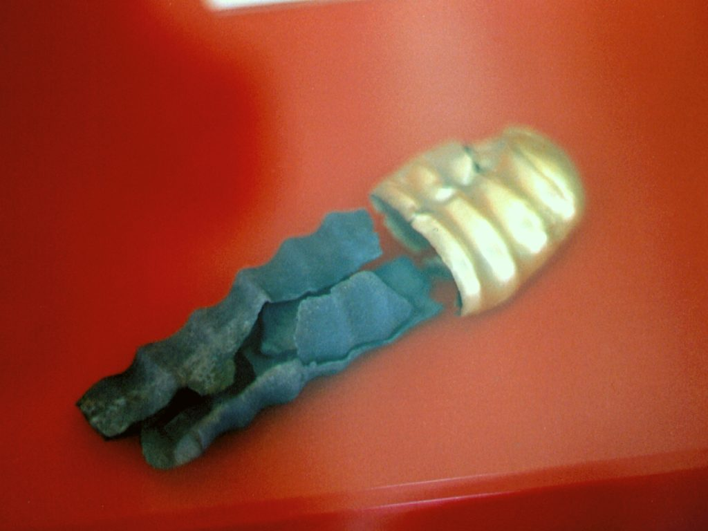
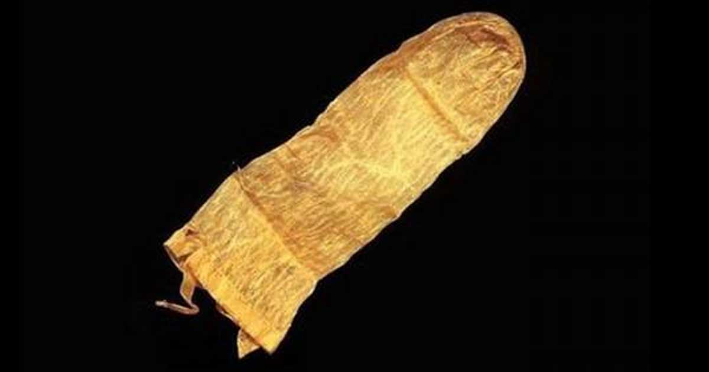
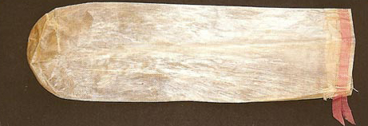

Today, the strangely-elongated bell shape of a condom is instantly recognizable. Condoms are the most-used sexual devices in the world, and in studies of sexuality and sex practices the vast majority of people report being familiar with condoms or have used one recently. The standard modern condom is made from latex and is used to prevent pregancy (with 98% effacacy if used correctly) and to act as a protection against most STDs. Polyurethane and lamb intestine condoms also exist for people allergic to latex or looking for a different experience, though the latter is not an effective barrier against STDs.

&nbsp;

Unfortunately, we have not always been blessed with easily-accessible and affordable condoms, and the history of condoms as a barrier device is a history spotted with many strange inventions, failures, and, well, babies.

&nbsp;

There are records of glans-style condoms&nbsp;(which just go over the head of the penis) going back to the late third century BC, specifically one discovered at a funeral site in what is now Turkey, made of gold and silver.

_Condom made of silver and gold, with geometrical reliefs, probably funeral. Alacahöyük, Bronze Age, late 3rd millennium BC. Museum of Anatolian Civilizations, Ankara.([wikimedia](https://commons.wikimedia.org/wiki/File:Condoms,_silver,_gold,_funeral,_Alacah%C3%B6y%C3%BCk,_late_3rd_millennium_BC,_MACA,_3068.jpg))_

Additionally, there is some research to suggest that use of oiled paper, leather or tortoiseshell condoms were common in China and Japan. But the real history of condoms kicks off in the late 1400s when the French army invaded what is now Italy and came face to face (or genitals to genitals) with the massive syphilis epidemic that was just beginning to kick off there. The returning troops spread the disease across Europe and it has haunted us since then (but is much more treatable now).

The Italian anatomist and physician Gabriele Falloppio was the first to undisputedly discuss condoms in his tract called _The French Sickness (1564)_, which ended up being published two years after his death&#8211;likely for it&#8217;s frank (heh) discussion of birth control and condoms. Falloppio&#8217;s condoms were made of linen and tied onto the erect penis with a string. They would have looked like these:

You can imagine how unfortunately these would have felt for both the wearer and the person it was being used on. Regardless, Falloppio claimed that he had run experiments on his rudimentary condom by having and patently-absurd number of 1100 Italian men fitted with the devices, instructed on their use and then commanded to go out and Genesis 9:7 the earth. As he expected, none of them caught the disease. While it is unlikely that Falloppio&#8217;s experiment would have held up to modern scientific scrutiny, it did introduce the idea and use of condoms to somewhat-general knowledge.

&nbsp;

Either way, Falloppio&#8217;s condoms (can we call them floppy condoms?) made their way across Europe and the English Channel at the very least, as they begin appearing in the diaries of British libertines and rakes&#8211;they make various appearances in Lord Rochester&#8217;s surviving records,and we begin to see quack doctors selling condoms alongside herbal erection treatments. By the way, the old tale about the name of the condom coming from a Dr. Condom providing them to King Charles II to help the king avoid children is a legend&#8211;Charles should have been trying harder for a heir, not avoiding it! English soldiers were known for using condoms made out of sheep and lambs intestine, and there was a privy dig that found examples going back to 1648.

&nbsp;

Giacomo Casanova, by the way, discusses how strongly he dislikes condoms in his diaries, where he referrs to them as &#8216;french letters,&#8217; a common turn of phrase:

> 

>   we set off to renew our voluptuous orgy. On the way he talked about modesty, and said,—
> 

> 
> 

>
> 

> 
> 

>   “That feeling which prevents our shewing those parts which we have been taught to cover from our childhood, may often proceed from virtue, but is weaker than the force of education, as it cannot resist an attack when the attacking party knows what he is about. I think the easiest way to vanquish modesty is to ignore its presence, to turn it into ridicule, to carry it by storm. Victory is certain. The hardihood of the assailer subdues the assailed, who usually only wishes to be conquered, and nearly always thanks you for your victory. . .
> 

> 
> 

>
> 

> 
> 

>   We found the three girls lightly clad and sitting on a large sopha, and we sat down opposite to them. Pleasant talk and a thousand amorous kisses occupied the half hour just before supper, and our combat did not begin till we had eaten a delicious repast, washed down with plenty of champagne.
> 

> 
> 

>
> 

> 
> 

>
> 

> 
> 

>   We were sure of not being interrupted by the maid and we put ourselves at our ease, whilst our caresses became more lively and ardent. The syndic, like a careful man, drew a packet of fine French letters from his pocket, and delivered a long eulogium on this admirable preservative from an accident which might give rise to a terrible and fruitless repentance. The ladies knew them, and seemed to have no objection to the precaution; they laughed heartily to see the shape these articles took when they were blown out. [EPISODE 15 — WITH VOLTAIRE / CHAPTER XIX]
> 

Boswell also documents his struggles with using a condom versus not with prostitutes. In this one account he talks about feeling good about using them:

> Tuesday 10 May 1763  
> At the bottom of the Haymarket I picked up a strong, jolly young damsel, and taking her under the arm I conducted her to Westminster Bridge, and then in armour complete did I engage her upon this noble edifice. The whim of doing it there with the Thames rolling below us amused me much.

But frequently for him he would forget or the prostitute would ask him not to use them (because of how uncomfortable they were), and he would scold himself for a week or more in his diary.

By the mid-to-late eighteenth century, however, condoms begin to become a problem. Well, they become a problem for upper-and-middle-class religious reformers. The focus now started to become on the use of the condom for contraceptive rather than protective purposes. First the Catholic Church, and then a number of Protestant figures, followed by secular doctors came out against the use of condoms as contraceptives. Part of this hysteria was a new emphasis on having sex over the perceived dangers of masturbation, the other part of it was that moral reformers recoiled at the thought of working class men and women purchasing condoms, which for years had been unaffordable to them (as they could cost up to a week&#8217;s worth of pay). Prices began to sharply fall with the introduction of rubber condoms by the 1850&#8217;s. These weren&#8217;t quite up to the level of quality as we would expect, as they often had a long seam down the middle that could cause chafing on the male member. They were also stiffer, which meant less pleasure but more reusability.

&nbsp;

By the 1860&#8217;s in England and by 1873 in the United States (with the passing of the Comstock laws), the public campaign again condoms was in its full swing. In the United States it was against the law to mail even information about condoms through the federal mail system. And god forbid you mailed actual condoms&#8211;one way or the other Anthony Comstock and his Law would (and did) come down incredibly powerfully on the educators, manufacturers and distributors of contraceptive devices &#8212; by the end of his reign he had destroyed hundreds of thousands of these devices, and chased sexual reformers like Victoria Woodhull out of the country and hounded others to death. It wouldn&#8217;t really be until World War I where governments began to see the risk of STDs to their (young and straight male) soldiers and embraced condoms as a prevenative device while at the same time educating the recruits on the dangers of STDs.

&nbsp;

In the United States, a Supreme Court decision in 1918 in favor of Margaret Sanger (the founder of Planned Parenthood) allowed condoms to be distributed and used by the general public, and by WWII anyone could get a condom from newly-invented vending machines.The 1950s and 60s saw the availibility of condoms increase when they were moved over the counters in stores and no longer hidden. The last remaining state laws and regulations against condoms collapsed in the face of the AIDS crisis of the 1980’s, and by the 90’s (only 20 years ago!) you could finally purchase condoms just about anywhere and the stigma against them was beginning to disappear.

&nbsp;

Sources:

_The Humble Little Condom: A History_ Aine Collier

The history of the condom. &#8212; Journal of the Royal Society of Medicine &#8212; H Youssef. https://www.ncbi.nlm.nih.gov/pmc/articles/PMC1293956/?page=1

The Memoirs of Jacques Casanova de Seingalt, 1725-1798. Complete by Casanova &#8212; https://www.gutenberg.org/ebooks/2981