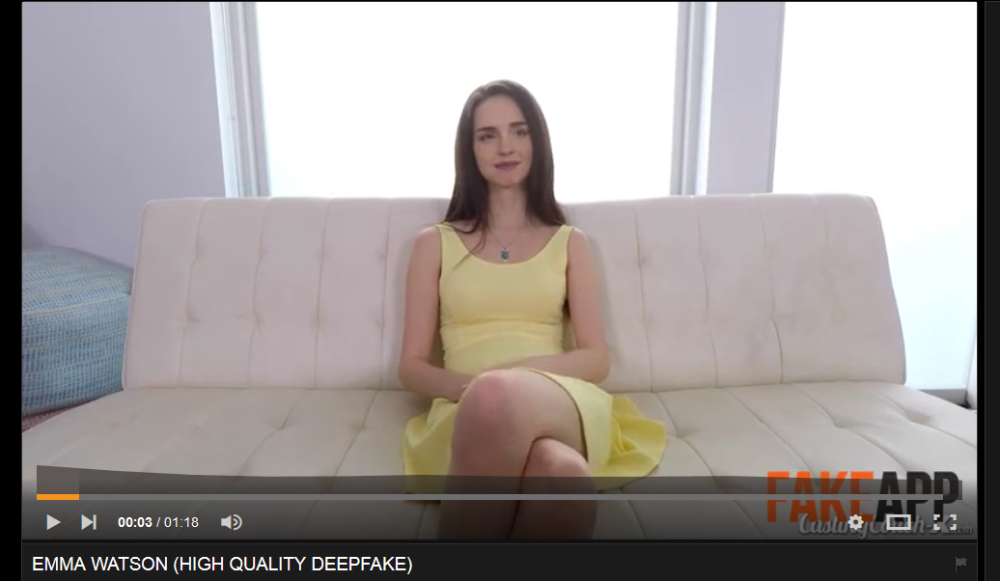
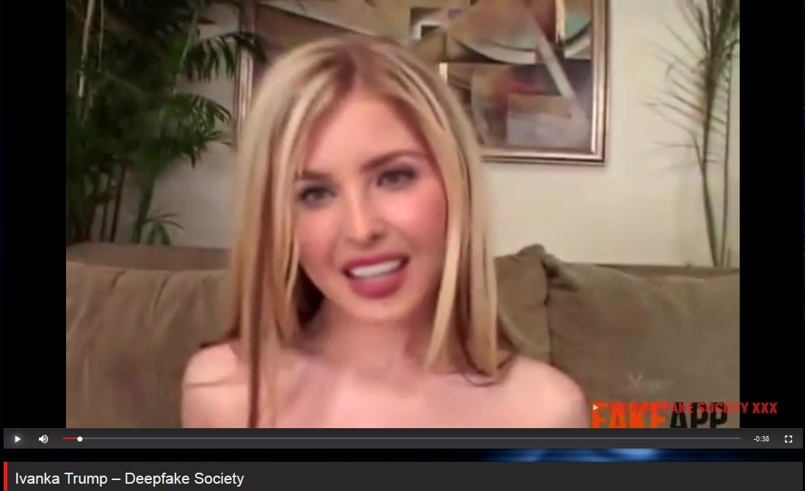

One of the most interesting recent developments in programming, the internet, celebrity culture and pornography is the recent explosion (and following suppression) of deepfakes. This development has all sorts of implications for the media, celebrities, politicians and, of course, just general reality. What interests me the most however, are the parallels with what we might term the Revolutionary Deepfake.

Before I get too far ahead of myself though, a brief primer. Deepfakes allow essentially anyone with a powerful-enough graphics card, computer, and enough archival data to edit a video on the fly, superimposing one face upon another. Gaurav Oberoi at Hackernoon has an [essential primer](https://hackernoon.com/exploring-deepfakes-20c9947c22d9) with examples where he swapped the faces of John Oliver and Jimmy Fallon on to each other with quite convincing results. He notes that there are (currently) some limitations to these deepfake models:

* **It only works if there are lots of images of the target**: to put a person into a video, on the order of 300–2000 images of their face are needed so the network can learn how to recreate it
* **You also need training data that is representative of the goal&#8230;** In general, training images of your target need to approximate the orientation, facial expressions, and lighting in the videos you want to stick them into.
* **Building models can get expensive**: it took 48 hours to get ok results, and 72 to get the fair ones above.

As this is the internet (and because the software appeared on Reddit first) this software was quickly used to superimpose the faces of celebrities onto pornographic models. Because of the popularity of Game of Thrones, and because HBO's sex scenes are apparently not sexy enough (??!?), Emilia Clark was a popular target, and her face was quickly superimposed onto the bodies of blonde pornographic models. Another celebrity target way-too creepily popular among reddit users was Emma Watson, whose likeness was involuntarily used to create pornographic movies:

The effect of these movies is to create disturbingly involuntary pornography that becomes increasingly convincing as the technology progresses. This is disturbing for all sorts of reasons, not to mention the use of someone's face in a sexual way--a consent violation if there ever was one, and it was quickly recognized as such and the material and the propagators and creators of it were quickly banned from Reddit, Twitter, Facebook and elsewhere. Pornhub said that it had cracked down on this material, and that it would not allow it going forward, but even a simple google search belies that fact, and it will become even harder in the future for pornhub and other pornographic sites to control this material.

Another implication that has been [talked about](https://motherboard.vice.com/en_us/article/bjye8a/reddit-fake-porn-app-daisy-ridley) [in several](https://www.nytimes.com/2018/03/04/technology/fake-videos-deepfakes.html) [publications](http://www.bbc.com/news/technology-42912529) are the political implications. When this becomes easy enough and cheap enough and convincing enough, it would be easy for someone to make a video of Barack Obama or Donald Trump saying something they had not and triggering a worldwide conflict or disturbing real-world consequences. Some members of the Trump family have already been used in this way:

Many of the discussion around the topic of deepfakes has rotated around the disturbing applications and pointing at certain doom and gloom and the unprecedented nature of this technology. Indeed, in recent history it is hard to identify something similar. But if you reach just a little bit further back to the end of the eighteenth century and the beginning of the nineteenth you hit on the original Revolutionary Deepfakes--also known as _The Forbidden Best-Sellers of Pre-Revolutionary France_ as Robert Darnton has named them.

Darnton's book has been [praised](https://muse.jhu.edu/article/413675/pdf), [critiqued](http://www.h-net.org/reviews/showrev.php?id=116), and commented upon in several places, so I don't intend to go into great depth here (though I will note that I'm a little critical of Darnton's over-dependence on one archive and that some of his conclusions are a bit dated now and could be updated, but it still remains a valuable contribution to the field). The significance for our discussion here, however, is that Darnton points out that there were dozens (and perhaps hundreds) of popular books that chronicled the scandalous and dissolute life of the monarchy. These books, tracts, and pamphlets, he argues, undermined the trust and the legitimacy of the royalty and the government in the eyes of the common people by "showing" in graphic terms what was "really going on" behind the closed doors of Versailles and elsewhere. The loss of trust and legitimacy that was created through these 'fake-news' pornographic texts eventually lead to people forming their own negative opinions about the church, the state, and the royalty and incited them into revolution.

There is indeed a precursor to pornographic deepfakes and fake news, and the last time it happened--fueled by the tipping-point popularization of the printing press and widespread literacy--it lead to the entire death of the ancien regime. It also lead to mass death, starvation, war, and destruction. Of course this is an overly-simplified argument, but you get the idea. What remains to be argued is how systems of governance, the media and 'reality' regained legitimacy after the shakeup of the revolution. What remains is that the media, government, and society needs to find a new way of claiming, gaining, and maintaining legitimacy in this tumultuous age.

