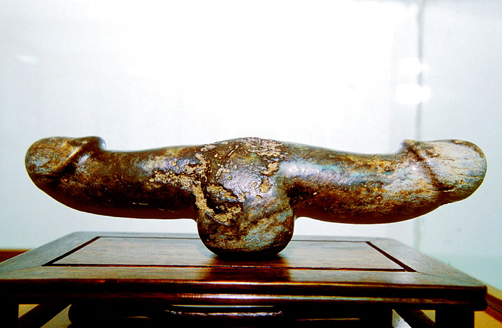
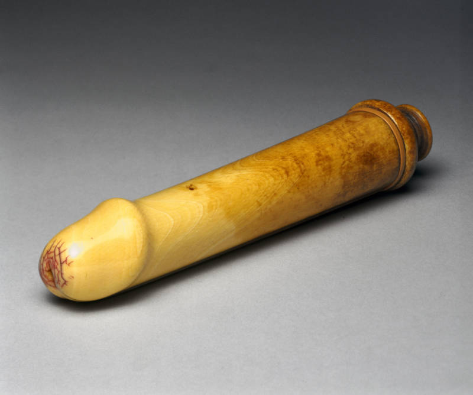

Dildos, for the four people on the internet that are somehow not yet aware of them, are sex toys intended for sexual penetration (of a male or female) during recreational bedroom activities. They are very often phallic in shape—which is to say explicitly penis-shaped—sometimes down to minute detail, but more often in a sort of general, abstract way.

A google search about the history of dildoes will turn up all sorts of =slideshows and pop-culture articles on the internet crediting the invention of dildos all the way back to the Paleolithic era, like these:



However, it is far more likely that these Paleolithic and Neolithic dildos were more sacred or religious items, like the [Venus of Willendorf](https://en.wikipedia.org/wiki/Venus_of_Willendorf), or even similar to the more modern Hindu Shiva-lingam (side note: don’t go saying that the lingam is a phallus today though, it is no longer considered so and has a much more complicated meaning). Sure, it is more than likely that there _were_ ancient or prehistoric dildos or sex toys, but I would argue that in order for something to explicitly be a dildo it has to have a more sexular secular association.

Therefore, in an interesting correspondence with the history of condoms, the first references to explicit sexual dildos dates to around 2300 years ago in third century BCE Asia Minor. Miletus, in what is now Balat, Turkey, was known as the production and distribution center of the _olisbos_ (from the word meaning to slip or glide). These were made of wood or pressed leather and likely smeared with olive oil before use—olive oil being prized for its lubrication as well as edification properties back in the day.

A third-century-BC text by Herodas documents a conversation between two women, Metro and Coritto. Metro has come to borrow Coritto’s dildo, but she has already lent it to her friend Euboula, who then handed it on to their mutual friend Nossis—dildos got around, back in the day. Coritto says

> That woman wore me down; she begged me so much that I weakened and gave it to her, Metro, before I had even used it myself. After seizing it like a godsend, she gives it away! If I had a thousand, I would not have given her one, even if it was all worn out.

However, she goes on to explain, much in the way that a nineteenth century teenager might tell another where to get a _Playboy_, that she bought it from Kerdon, a trader who covers up his illicit olisbos trade by making shoes (perhaps this is the origin of the legend that big shoes mean big…):

> But the things he makes, all of them, are worthy of Athena; you would believe that you could see her hand, instead of Kerdo’s. He came here with two, Metro! When I saw them, my eyes nearly popped out with desire. The men certainly have no rams like those… And that’s not all: their smoothness – a dream; and the stiches, of down, not of thread! Hunt as you might, you could not find another cobbler so kindly disposed towards women.

The _olisbos_ is also mentioned in Aristophanes’ _Lysistrata_, but to stop for a moment on Coritto’s comment that “The men certainly have no rams like those” belies one of the things that would follow dildoes from ancient to early modern and even modern times—male anxiety over dildos being used to replace them. This remains a near-constant anxiety until even to modern-day Texas, where it is still illegal to possess or promote the use of (six or more) dildos.

It seems that since the early days of history men have always worried about their penis size and ability to please women with it. Indeed, shortly afterwards we can find references to penis extenders (prosthetic attachments that go over the penis) that the _Kama Sutra_ advises can be made out of wood or leather (which I imagine as the poor person’s choice), buffalo horn or ivory (getting towards middle-class sex toys), silver or gold (for the real high-end consumers). They were meant to go over a male erection to make it look larger and to please a female partner. The Kama Sutra also advises

> When a man wishes to enlarge his lingam, he should rub it with the bristles of certain insects that live in trees, and then, after rubbing it for ten nights with oils, he should again rub it with the bristles as before. By continuing to do this a swelling will be gradually produced in the lingam, and he should then lie on a cot, and cause his lingam to hang down through a hole in the cot. After this he should take away all the pain from the swelling by using cool concoctions. The swelling, which is called Suka, and is often brought about among the people of the Dravida country, last for life….
> 
> The enlargement of the lingam is also effected by rubbing it or moistening it with oil boiled on a moderate fire along with the seeds of the pomegranite, and the cucumber, the juices of the valuka plant, the hasti-charma plant, and the egg-plant.

I do not recommend any of these recipes, nor do I recommend the weird coconut one that was going around reddit a few months back, and please do not try at home—and if you do, I waive all responsibility and hope a fertility god has mercy on your poor choices.

To dip even further east for a moment, there are suggestions that the first double-headed dildo for use between two women was developed in China in the 12th and 13th century, as the below was excavated—but I remain skeptical for reasons already explained above:

_Double-headed marble phallic item on display at the China Sex Museum._

Regardless, apart from the occasional reference to dildos in Roman and Greek literature, and the obviously untrue urban legend that Cleopatra invented the first vibrator by filling a hollow gourd with angry bees, and a variety of priapic saint legends (Such as Saint Fiacre, Guerlichon or Foutin) the dildo does not manage to crop up again in an innovative way until the Renaissance.

In fact, it was Renaissance Italy that would give us the word dildo—from the Latin dilatare, to open wide, or (more likely) from the Italian diletto, to delight. The first reference to the modern-day dildo originates in Pietro Aretino’s _Dialogues_, which is very often considered the first literary pornography and Aretino the “father” of pornography. The _Dialogues_ revolve around the life of Nanna, who is an older courtesan agonizing over what to do with her daughter.

Unlike a son, whom she could send off to school or the military, or to anything he desired with her riches, her daughter can only become a nun, a wife, or a whore, so she is stuck in a conundrum. &#8220;But,&#8221; her friend Antonia asks, &#8220;Weren&#8217;t you a nun, a wife, and a courtesan?&#8221; &#8220;Yes,&#8221; Nanna replies, but &#8220;nowadays nuns, wives, and whores live different lives from what they used to.&#8221; &#8220;Hah!&#8221; exclaims Antonia &#8220;Life has always been lived in the same way: people have always eaten, have always drunk, have always slept.&nbsp;.&nbsp;.and women have always pissed through the crack. Now, I would dearly love for you, Nanna, to tell me about the lives of the nuns, wives, and whores of your day, and I will tell you what you should do with your [daughter] Pippa.” In the first dialogue, she talks about how her parents force her into the nunnery because her father did not want to pay for her dowry. She takes her vows and then is led into a dinner feast to celebrate. When she enters the refectory (dining room) of the nunnery, she finds, to her great confusion, that &#8220;fresh, gleaming rosy&#8221; nuns and &#8220;handsome, well-groomed and gay young&#8221; monks and friars welcomed her eagerly by kissing her, &#8220;even vying with each other to see who could give the most honeyed ones [tongue kisses].&#8221;

Still innocent and pure, and unaware of what was going on, Nanna sits down to eat with the nuns and monks, when suddenly, a man appears with a gift for the diners which are the cause of much laughter and appreciation. Nanna relates that, “They were glass fruits made in Murano near Venice to look like a prick. (But I was too innocent to realize that at the time).” She very soon comes to realize it, however, and uses the glass fruit in a fruitful way.

After this, the dildo avalanche is nearly unstoppable. In English it is first introduced by Thomas Nashe in 1592 _Merrie Ballad of Nash, His Dildo_ also known as _Choice of Valentines_. The narrator of this poem is a young man who courts a prostitute on valentine’s day and finds that he is, well, not up to the task, and after a number of attempts she gets frustrated and gives up and reaches for her little glass friend

> Henceforth I will no more implore thine aid,  
> Or thee for ever of Cowardice shall upraid:  
> My little dildoe shall supply your kind,  
> A youth that is as light as leaves in wind:  
> He bendeth not, nor foldeth any deal,  
> But stands as stiff as he were made of steel;  
> (And plays at peacock twixt my legs right blithe  
> And doeth my tickling swage with many a sigh;)  
> And when I will, he doth refresh me well,  
> And never makes my tender belly swell.”

The old male anxiety comes on fast, of course:

> Poor Priapus, thy kingdom needs must fall,  
> Except thou thrust thus weakling to the wall;  
> Behold how he usurps in bed and bower,  
> And undermines thy kingdom every hour:  
> And slyly creeps between the bark and tree,  
> And sucks the sap while sleep detaineth thee:  
> He is my Mistress lake at every sound,  
> And soon will tent a deep intrenched wound;  
> He waits on courtly nymphs that are full coy,  
> And bids them scorn the blind alluring boy;  
> (He gives young girls their gamesome sustenance,  
> And every gaping mouth his full sufficiance.)  
> He fortifies disdain with foreign arts,  
> While wantons chaste delude all loving hearts.  
> If any wight a cruel Mistress serve,  
> And in despair full deeply pine and sterve,  
> (Curse Eunuch dildo, senseless counterfeit,  
> Who sooth may fill, but never can beget:  
> But if revenge enraged with despair,  
> That such a dwarf his welfare should impair,)

The next reference is within a couple years, with the lute song “Will you buy me a fine dog,&#8221; with the fine lyrics of:

> Will you buy a fine dog, with a hole in his head?  
> With a dildo, dildo, dildo;  
> Muffs, cuffs, ribatos, and fine sisters&#8217; thread,  
> With a dildo, dildo;  
> I stand not on points, pins, periwigs, combs, glasses,  
> Gloves, garters, girdles, busks, for the brisk lasses;  
> But I have other dainty tricks,  
> Sleek stones and potting sticks,  
> With a dildo, diddle, dildo;  
> And for a need my pretty pods,  
> Amber, civet, and musk cods,  
> With a dildo, with a diddle, dildo!

Hear it here:


It is likely Shakespeare was referencing this particular song or one like it in _The Winter’s Tale_ where there is a call out to a “burden (refrain) of dildos.” And it’s not just Englishmen—the French obscene novel _L’Escole des Filles ou la Philosophie des dames_ has the two young women discussing a wooden pump action dildo that allowed for milk or cream to be ejaculated from the tip at the appropriate moment—it would have looked like this:

_Used ivory dildo with plunger in the back, likely 18thC French._

By now, dildos are being made of wood, metal, glass, and stone.&nbsp; They are banned from many countries, but are still smuggled in by enterprising men and women, such as John Wilmot, the Earl or Rochester, who wrote perhaps the finest ode to dildos in any language, Signior Dildo. Written in 1673 as a biting satire against the women of the King&#8217;s Court, both mistresses and higher class women like the Duchess of Cleveland. As a result, it starts off with an address to &#8220;You Ladyes all of Merry England / Who have been to kisse the Dutchesse&#8217;s hand,&#8221; and asks them &#8220;Pray did you lately observe in the Show / A Noble Italian call&#8217;d Signior Dildo?&#8221;&nbsp; Unlike his Ramble in St James&#8217; the poem jauntily specifies courtly ladies and their relation with &#8216;Signor Dildo:&#8217;

> The Countesse of Falmouth, of whom People tell  
> Her Footmen wear Shirts of a Guinea an Ell: [very expensive shirts]  
> Might Save the Expence, if she did but know  
> How Lusty a Swinger is Signior Dildo.  
> . . .That Pattern of Virtue, her Grace of Cleaveland,  
> Has Swallow&#8217;d more Pricks, then the Ocean has Sand,  
> But by Rubbing and Scrubbing, so large it do&#8217;s grow,  
> It is fit for just nothing but Signior Dildo.  
> The Dutchesse of Modena, tho&#8217; she looks high,  
> With such a Gallant is contented to Lye:  
> And for fear the English her Secrets shou&#8217;d know,  
> For a Gentleman Usher took Signior Dildo.  
> . . .Doll Howard no longer with his Highness must Range,  
> And therefore is profer&#8217;d this Civill Exchange:  
> Her Tee th being rotten, she Smells best below,  
> And needs must be fitted for Signior Dildo.

Signor Dildo is such a good and tireless lover that he unseats many lords and men of the court, whose insecurity Rochester satirizes in the poem by calling them by the name &#8216;Count Cazzo&#8217; [Count Prick]. And there was, in fact, a great deal of masculine insecurity surrounding the dildo, as it was banned in England for centuries. The end of the poem comes when &#8216;a Rabble of Pricks&#8217; becomes upset that they are no longer getting laid:

> A Rabble of Pricks, who were welcome before,  
> Now fin ding the Porter deny&#8217;d &#8217;em the Door,  
> Maliciously waited his coming below,  
> And inhumanely fell on Signior Dildo.  
> Nigh weary&#8217;d out, the poor Stranger did fly  
> And along the Pallmall, they follow&#8217;d full Cry,  
> The Women concern&#8217;d from every Window,  
> Cry&#8217;d, Oh! for Heavn&#8217;s sake save Signior Dildo.

Although dildos (and sex toys generally) would face prosecution and band from the 1600’s on, they remained largely available and in use from the 1700’s on. In the United States it took until the 2003 _Lawrence v. Texas_ decision for the ban on sex toys to be fully lifted, and in England and most European countries there was never a full legal ban on the books like there was with other items like condoms or birth control. Today, dildos and sex toys are a $15 billion dollar market that is accessible from nearly any place, online or off.

&nbsp;

Sources:

My book: _[Annals of Pornographie: How Porn Became Bad](https://www.amazon.com/Annals-Pornographie-How-Porn-Became/dp/1311042458/ref=tmm_pap_swatch_0?_encoding=UTF8&qid=&sr=)_

_Kamasutra_, translated by Sir Richard Francis Burton

_In Bed with the Ancient Greeks_, by Paul Chrystal

_Nashe’s Choice of Valentines_: <http://www.bartleby.com/334/90.html>

_Will you buy me a fine dog_? <https://www.youtube.com/watch?v=sK7s63T1sXY>

_Signior Dildo_, John Wilmot, Earl of Rochester, https://andromeda.rutgers.edu/~jlynch/Texts/dildo.html