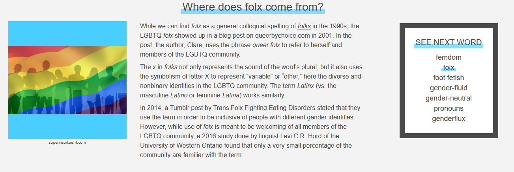
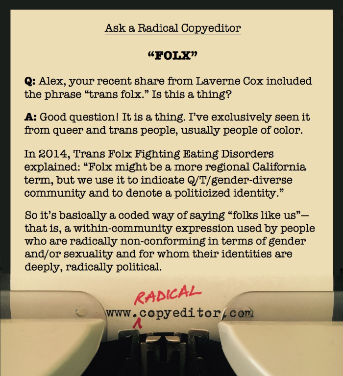

This question has come up [again](https://twitter.com/SpookyColbert/status/1158553063688290304) and [again](https://twitter.com/MalBlum/status/1184287339977302016) on twitter so

I am here I am here with answers y'all, and to expand on my tweets there.

The most in-depth research was done by [the team at Dictionary.com](https://www.dictionary.com/e/gender-sexuality/folx/), who define it as

> "A variation on the word folks, folx is meant to be a gender-neutral way to refer to members of or signal identity in the LGBTQ community." [Source](https://www.dictionary.com/e/gender-sexuality/folx/)

This definition hits on some important aspects–especially noting that it is a 'signal.'

While some (quite silly) people declaim this sort of \& 'performative language' like it is a bad thing, or not genuine, I would argue the opposite: by using it (and using it genuinely) you're showing that you've (hopefully) done some of the work and thinking about your own positionality. In the same way that one might talk about Black thinkers or activists.

Dictionary.com does note its very recent history

This history is also copied here on Radical Copyeditors:

These both point to a more recent history, but the term is actually older, originating from the BiNet and GirlFags BBSes, as WordSpy most accurately documents:

> *I resent it that some queer folx (primarily non-choice gay or lesbian folx) think I would just deny my queerness at the first sign of inconvenience. —Clare, Queer By Choice, May 6, 2001*

> Notes: One fairly new mechanism for producing fresh lingo is to reduce the variant spellings of a word to a single term by replacing the changeable letter or letters with x. For example, instead of writing women or womyn some people just write womxn. Instead of the gender-specific latina or latino, some prefer the gender-neutral latinx…

> Does this explain the x in folx? Not quite. The x isn’t being used to consolidate multiple spellings, but multiple labels: gay, lesbian, bisexual, transgendered, gender-variant, two-spirited, and others.

There you have it: folx is absolutely performative, and it has been embraced by multiple intersections, mostly those of a GSRM (Gender Sexuality and Relationship Minorities) background, but also by native folx to emphasize gender as colonial imposition.